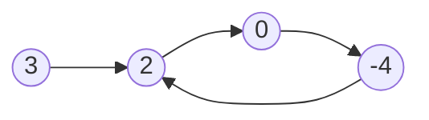
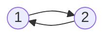

# [142. 环形链表 II](https://leetcode.cn/problems/linked-list-cycle-ii/)

## 题目描述

给定一个链表的头节点  `head` ，返回链表开始入环的第一个节点。 如果链表无环，则返回 `null`。

如果链表中有某个节点，可以通过连续跟踪 `next` 指针再次到达，则链表中存在环。 为了表示给定链表中的环，评测系统内部使用整数 `pos` 来表示链表尾连接到链表中的位置（索引从 `0` 开始）。如果 `pos` 是 `-1`，则在该链表中没有环。**注意：`pos` 不作为参数进行传递**，仅仅是为了标识链表的实际情况。

**不允许修改** 链表。

示例 1：



> 输入：`head = [3,2,0,-4], pos = 1`
> 输出：返回索引为 `1` 的链表节点
> 解释：链表中有一个环，其尾部连接到第二个节点。

示例 2：



> 输入：`head = [1,2], pos = 0`
> 输出：返回索引为 `0` 的链表节点
> 解释：链表中有一个环，其尾部连接到第一个节点。

示例 3：


> 输入：`head = [1], pos = -1`
> 输出：返回 `null`
> 解释：链表中没有环。

提示：

* 链表中节点的数目范围在范围 `[0, 104]` 内
* `-105 <= Node.val <= 105`
* `pos` 的值为 `-1` 或者链表中的一个有效索引

进阶：你是否可以使用 `O(1)` 空间解决此题？

## 前置知识

## 解题思路

### 哈希表

### 快慢指针

设 `head` 到环点的距离为 `a` ，快慢指针相遇的点到环点的距离为 `b` ，快指针绕环走了 `n` 圈，此后再次到环点的距离为 `c` 。

```
_____a_____%_________b_______%____
           |                     |
           |__________c__________|
```

那么有 $\frac{a+n(b+c)+b}{a+b}=2$ ，整理后得到

$$
a=c+(n-1)(b+c)
$$

距离 `a` 的值可以理解为从相遇的那一刻起，再次绕环 `n-1` 圈加上距离 `c` 之后的值。我们新建一个指针 `ptr` 指向 `head` ，它和慢指针速度相同，`slow` 指向相遇点，然后两个指针以同样的速度向前出发，那么他们将会在环点相遇。

## 代码实现

Java Code：

见 [快慢指针Java实现](../java/P142LinkedListCycle2.java) 。